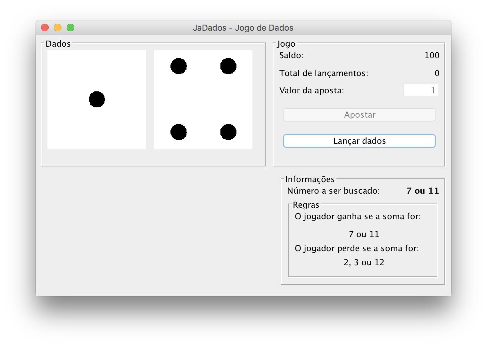

# Jogo de dados (craps) em Java Swing com Threads

Nesse repositório tem o esqueleto do jogo na forma de projeto Netbeans, porém compete ao aluno implementar a lógica de apostas, parte programação concorrente (threads) para simular o sorteio dos dados.

No diretório [exemplo](exemplo) tem um arquivo JAR de uma aplicação exemplo para mostrar como deverá ser o sorteio simulado dos dados. Para executar a aplicação no terminal faça:

`java -jar exemplo/JaDadosGUI-exemplo.jar` 

